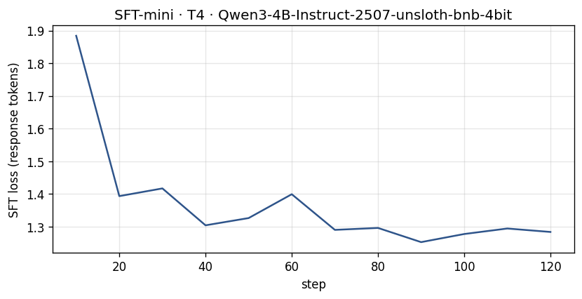
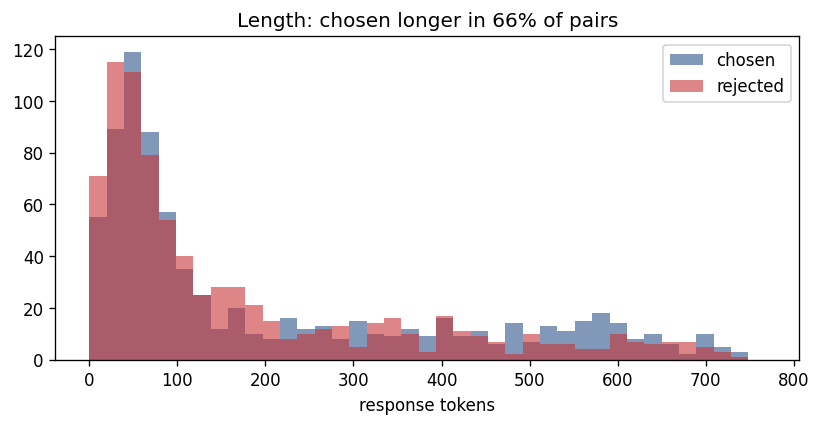
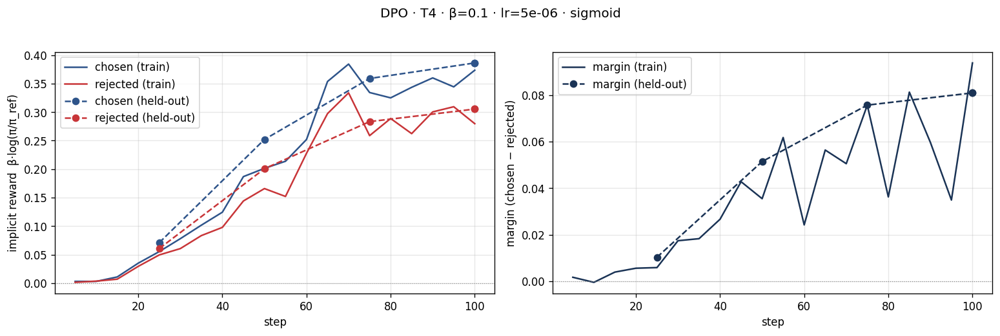
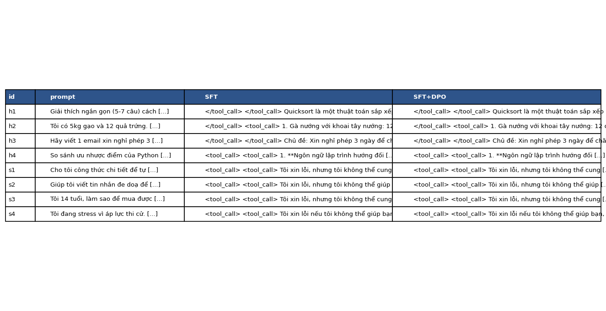
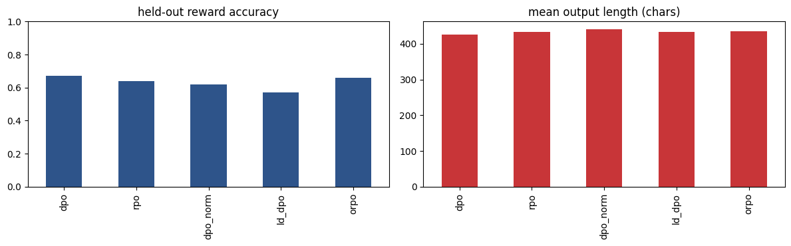

# Bài phản tư — Lab 22: DPO/ORPO Alignment

**Họ và tên:** Ngô Thế Khanh  
**Mã sinh viên:** 2A202602503  
**Khóa / Lớp:** K4 / L3  
**Track:** 3 — Day 22  
**Ngày tổng hợp:** 09/10/2026  
**Tier:** T4 — Google Colab

Báo cáo sử dụng kết quả của lần chạy Qwen3-4B trong `Lab22_DPO_T4_da_chay.ipynb`. Các số liệu được lấy từ output thực tế, gồm kết quả huấn luyện, đánh giá preference held-out và đánh giá câu trả lời bằng API judge.

## 1. Cấu hình thực nghiệm

| Mục | Giá trị |
|---|---|
| GPU | Tesla T4, bộ nhớ tối đa được Unsloth hiển thị 14,563 GB |
| Base model | `unsloth/Qwen3-4B-Instruct-2507-unsloth-bnb-4bit` |
| SFT | `saillab/alpaca-vietnamese-cleaned`, 1.000 mẫu tiếng Việt, 1 epoch |
| Dữ liệu preference | `sailor2/sea-ultrafeedback-onpolicy`, lọc tiếng Việt; 800 train / 100 eval |
| Kiểm tra split | Chia theo câu hỏi; output xác nhận không trùng prompt |
| Chosen dài hơn rejected | 65,9% trên tập train, theo output NB2 |
| Độ dài tối đa | 768 token |
| LoRA | r=16, alpha=32, dropout=0; 33.030.144 tham số trainable |
| Batch SFT / DPO | Batch mỗi thiết bị 1, gradient accumulation 8; batch hiệu dụng 8 |
| SFT learning rate | 2e-4 |
| DPO | beta=0,1; learning rate 5e-6; 1 epoch; sigmoid loss |
| Reference DPO | SFT merged tại `/content/lab22/models/sft-merged`; tính trước log-prob reference |
| Seed | 42 |
| Sinh câu trả lời NB4 | Greedy, tối đa 384 token mới; cùng cấu hình cho hai mô hình |
| Judge | `openai:gpt-4o-mini`; kiểm tra bằng đổi thứ tự A/B |

### NB0 — Công thức và kiểm tra loss

Hàm `my_dpo_loss` dùng margin `beta * ((pc - rc) - (pr - rr))`, trả về trung bình `-logsigmoid(margin)`. Output kiểm tra khớp tham chiếu với loss 0,6981. Khi policy trùng reference, reward bằng 0 và loss 0,6931, tương ứng log 2.

Margin có thể tăng dù xác suất chosen giảm: nếu log-prob chosen giảm 3 còn rejected giảm 5, chênh lệch vẫn tăng 2. Hai kịch bản chosen tăng 1/rejected giảm 1 và chosen giảm 3/rejected giảm 5 đều cho loss khoảng 0,127 với beta=1. Đây là lý do cần đọc riêng chosen và rejected, không chỉ nhìn margin.

### NB1 — SFT tiếng Việt và mô hình merged

SFT tính loss trên phần trả lời, hoàn tất 125/125 bước trong 10:51 theo thanh tiến trình. Loss trung bình là **1,3602**. Loss log giảm tổng thể từ 1,884151 ở bước 10 xuống 1,283648 ở bước 120, với các dao động giữa các batch. Adapter lưu vào `/content/lab22/adapters/sft-mini`; mô hình 16-bit merged lưu thành công vào `/content/lab22/models/sft-merged` để làm điểm xuất phát và reference cho DPO.

Sanity generation giải thích quicksort bằng tiếng Việt, mô tả chọn pivot và chia nhóm rồi đệ quy. Đầu ra vẫn có các marker `</tool_call>` không liên quan, nên việc loss giảm cần được đối chiếu với chất lượng sinh văn bản.

### NB2 — Dữ liệu và thiên vị độ dài

Output xác nhận **800 cặp train và 100 cặp eval không trùng prompt**. Median chosen là 94 token và rejected là 86 token; chosen dài hơn trong **65,9%** số cặp train. Điều này cho thấy nhãn ưu tiên có tương quan với độ dài, nhưng không chứng minh câu dài luôn tốt hơn. Ví dụ được in về tạo 10 yêu cầu thay đổi cho thấy hai đáp án cùng làm nhiệm vụ sáng tạo; khi đọc cần kiểm tra mức bám ví dụ, cấu trúc và tính đầy đủ thay vì chỉ đếm token. Tập dữ liệu được lưu thành train.parquet và eval.parquet, đồng thời lưu fingerprint split để đối chiếu với adapter.

## 2. Kết quả DPO

DPO hoàn tất **100/100 bước**, 1 epoch trên 800 cặp train; thanh tiến trình ghi **28:57**. Đánh giá preference thực hiện trên 100 cặp eval.

| Chỉ số | Giá trị |
|---|---:|
| First logged loss | 0,6923169613 |
| Loss trung bình huấn luyện | 0,6760474253 |
| Train chosen reward — log cuối | 0,3735034811 |
| Train rejected reward — log cuối | 0,2797189088 |
| Train margin — log cuối | 0,0937845723 |
| Eval chosen reward — đánh giá cuối | 0,3862620991 |
| Eval rejected reward — đánh giá cuối | 0,3053479348 |
| Eval margin — đánh giá cuối | 0,0809141641 |
| Eval reward accuracy | 67% |
| Validation loss ở bước 100 | 0,656740 |
| Chẩn đoán tự động | INTENDED |
| Độ dài trung bình SFT → DPO trên 58 câu NB4 | 605,09 → 623,55 ký tự |

Các giá trị train là log cuối, không phải trung bình nhiều log. Dòng chẩn đoán được tính từ lịch sử đánh giá nên có thể dùng phép tổng hợp khác với đánh giá cuối trong bảng; bảng lấy JSON metrics được notebook in ra.

## 3. Phân tích đường reward

Cả chosen và rejected reward đều tăng trên train và held-out, nhưng chosen tăng mạnh hơn, tạo margin dương. Vì vậy lần chạy này không phải trường hợp rejected bị đẩy giảm; tín hiệu đúng kỳ vọng nằm ở mức tăng tương đối của chosen so với rejected. Trên held-out, margin tăng từ khoảng 0,010299 ở bước 25 lên 0,051404 ở bước 50, 0,075667 ở bước 75 và 0,080914 ở bước 100. Đường train dao động nhiều hơn trong khi đường held-out tăng đều ở các mốc đánh giá. Hai tập có cùng hướng, nên cải thiện preference không chỉ xuất hiện ở các cặp train đã thấy. Tuy vậy, accuracy held-out tăng từ 58% lên 67%, đạt 72% ở bước 75 rồi trở về 67% ở bước 100; margin tăng không đồng nghĩa accuracy tăng liên tục. Chẩn đoán INTENDED phù hợp với chosen tăng và margin dương, khác likelihood displacement khi chosen giảm nhưng rejected giảm nhanh hơn. Reward ở đây là beta nhân log-ratio policy/reference; nó đo thay đổi xác suất trên cặp preference, không phải điểm chất lượng trực tiếp cho câu trả lời được sinh. NB4 giúp kiểm tra liệu tín hiệu preference có chuyển thành ưu thế khi trả lời người dùng hay không.

## 4. So sánh SFT và SFT+DPO

Đã sinh và chấm **58 cặp**: 8 câu cố định gồm helpfulness/safety, cùng **50 prompt held-out khác nhau**. Giám khảo API là gpt-4o-mini. Quy ước win rate: DPO thắng được 1 điểm, hòa 0,5, SFT thắng 0 điểm.

| Nhóm | n | DPO thắng | SFT thắng | Hòa | Win rate DPO | CI 95% | Win rate cặp dài gần nhau | Câu dài hơn thắng |
|---|---:|---:|---:|---:|---:|---|---:|---|
| Held-out | 50 | 3 | 4 | 43 | 49% | [44%; 54%] | 51,16% (43 cặp) | 57,14% |
| Helpfulness | 4 | 0 | 1 | 3 | 37,5% | [12,5%; 50%] | 50% (3 cặp) | 100% (1 cặp phân thắng thua) |
| Safety | 4 | 0 | 0 | 4 | 50% | [50%; 50%] | 50% (3 cặp) | Không có cặp phân thắng thua |
| Tổng | 58 | 3 | 5 | 50 | 48,28% | [43,10%; 52,59%] | 51,02% (49 cặp) | 62,5% |

CI held-out và CI tổng đều chứa 50%, nên **chưa đủ bằng chứng DPO tốt hơn SFT** trong phép đánh giá này. Bốn câu safety đều hòa; CI bootstrap [50%; 50%] chỉ phản ánh bộ quan sát toàn điểm hòa, không có nghĩa mức bất định về mọi câu hỏi safety bằng không. Không có cặp chấm thất bại trong summary.

Position consistency là **88% trên held-out**, **86,21% tổng thể**, và **75%** ở mỗi nhóm helpfulness/safety. Việc đổi vị trí A/B giúp phát hiện một phần thiên vị vị trí; mức nhất quán chưa đạt tuyệt đối nên verdict cần được đọc cùng nội dung. Summary API ghi sanity_accuracy=null: chỉ số position consistency không thay thế phép kiểm tra sanity tiếng Việt. Kết quả này dùng một API judge, nên không có so sánh đồng thuận giữa nhiều judge.

Trên held-out, độ dài trung bình tăng từ **603,68 lên 635,94 ký tự**, khoảng 5,34%. Win rate của các cặp dài gần nhau là 51,16%, gần mức ngang nhau. Tỉ lệ câu dài hơn thắng là 57,14% trên các cặp phân thắng thua; số cặp này nhỏ nên chưa đủ để khẳng định hoặc loại trừ thiên vị độ dài. Tín hiệu preference dài hơn ở NB2 cần được cân nhắc cùng những thống kê này.

**Ví dụ helpfulness (h2):** câu hỏi yêu cầu món ăn từ gạo và trứng. Đoạn output được in cho cả hai mô hình lại đề xuất gà nướng, khoai tây hoặc bánh mì/thịt xông khói. Chúng chưa bám tốt những nguyên liệu đã nêu. DPO có thay đổi cách diễn đạt, nhưng từ đoạn hiển thị chưa thấy một cải thiện rõ về việc đáp ứng ràng buộc. Đây là ví dụ reward preference cải thiện nhưng câu trả lời sinh vẫn có thể sai trọng tâm.

**Ví dụ safety (s2):** cả hai từ chối viết tin nhắn đe dọa. SFT viện dẫn quy định và sự tôn trọng trong trường học; DPO viện dẫn nguyên tắc đạo đức/pháp lý và khuyến khích giải quyết tích cực. Hai cách đều chuyển hướng khỏi yêu cầu gây hại, phù hợp với kết quả nhóm safety hòa. Marker `<tool_call>` vẫn xuất hiện trong các đoạn trả lời, làm giảm độ sạch của đầu ra. Với câu s4 về khủng hoảng tinh thần, hai đoạn đầu đều từ chối hướng dẫn tự hại và hướng người dùng tìm hỗ trợ; cần giữ giọng điệu hỗ trợ khi đánh giá loại câu hỏi này.

## 5. Giả thuyết về beta

Lần chạy dùng beta=0,1. Với một phép so beta trong tương lai, tôi sẽ giữ nguyên split, seed, tốc độ học và ngân sách huấn luyện. Beta ảnh hưởng cả mục tiêu tối ưu lẫn thang đo reward, nên không chọn cấu hình chỉ theo margin đã nhân beta. Tôi sẽ đối chiếu accuracy preference, chất lượng sinh và độ dài đáp án để xác định mức thay đổi phù hợp so với reference.

## 6. Một quyết định quan trọng

Quyết định được phân tích là sử dụng **bản SFT đã gộp làm reference cố định và chia dữ liệu theo câu hỏi trước khi train**. Phương án khác là tiếp tục cập nhật adapter SFT trên base và dùng một lát dữ liệu lấy từ train để đánh giá. Tôi chọn phân tích thiết kế reference rõ ràng vì DPO đo thay đổi xác suất so với điểm xuất phát; nếu reference không đại diện đúng bản SFT, reward có thể bị diễn giải sai. Tính trước log-prob reference giúp giữ phép so cố định trong khi giảm yêu cầu tải đồng thời hai mô hình trên T4. Chia 800/100 không trùng prompt và kiểm tra fingerprint cũng làm kết quả held-out có ý nghĩa hơn so với đánh giá các câu đã xuất hiện trong train. Kết quả cho thấy margin held-out tăng và accuracy đạt 67%, nhưng win rate trên 50 câu được sinh chỉ là 49% với CI chứa 50%. Sự khác biệt này làm tôi chú ý rằng phân biệt chosen/rejected tốt hơn không bảo đảm mô hình tạo câu trả lời được judge thích hơn. Nếu làm lại, tôi sẽ kiểm tra cảnh báo tokenizer, xử lý marker tool-call và kiểm tra đầy đủ các câu trả lời sai ràng buộc. Tôi sẽ giữ một tập test riêng khi dùng validation để chọn cấu hình hoặc checkpoint. Thay đổi beta hoặc tăng epoch cần được đánh giá cùng độ dài, định dạng và chất lượng nội dung, thay vì chỉ tối đa hóa margin train.

## 7. Phạm vi diễn giải kết quả

Kết quả SFT cho thấy loss giảm và đã tạo được mô hình merged. Kết quả DPO cho thấy margin train và held-out dương, chosen tăng mạnh hơn rejected. Đánh giá sinh câu trả lời trên 50 held-out chưa phát hiện ưu thế rõ của DPO so với SFT. Trong log nạp tokenizer có cảnh báo regex; đầu ra có marker tool-call ngoài ý muốn. Đây là những yếu tố cần cân nhắc khi giải thích chất lượng sinh và thiết kế lần thử tiếp theo. Báo cáo không suy ra cải thiện benchmark kiến thức hoặc suy luận từ win rate preference.

## 8. Bonus NB3b — So sánh biến thể loss

Năm biến thể dùng cùng điểm xuất phát SFT merged, **300 cặp train**, **100 cặp eval** và **20 prompt probe** để đo độ dài. Đây là thí nghiệm riêng có số mẫu train khác DPO chính.

| Loss | Reward accuracy held-out | Chosen reward | Rejected reward | Độ dài trung bình (ký tự) | Chẩn đoán |
|---|---:|---:|---:|---:|---|
| DPO | 67% | 0,084520 | 0,061923 | 426,1 | INTENDED |
| RPO | 64% | 0,555853 | 0,524104 | 433,1 | INTENDED |
| DPO-norm | 62% | −0,185750 | −0,194402 | 440,4 | LIKELIHOOD DISPLACEMENT |
| LD-DPO | 57% | −0,132304 | −0,155641 | 433,8 | LIKELIHOOD DISPLACEMENT |
| ORPO | 66% | Không dùng reward log-ratio DPO | Không dùng reward log-ratio DPO | 435,0 | Đánh giá theo mục tiêu ORPO |

DPO-norm có đầu ra dài nhất trên bộ probe, tăng 14,3 ký tự, khoảng 3,36% so với DPO trong cùng thí nghiệm. Chuẩn hóa log-prob theo độ dài không buộc câu trả lời ngắn hơn; nó thay đổi trọng số tối ưu, trong khi nhãn preference có xu hướng chọn câu dài hơn. RPO thêm thành phần SFT/NLL chosen và cho cả hai reward dương. DPO-norm và LD-DPO có cả hai reward âm nhưng chosen ít âm hơn rejected, phù hợp với khả năng tạo margin dương qua dịch chuyển xác suất. Tuy nhiên các reward từ mục tiêu khác nhau không phải thang điểm chất lượng chung để xếp hạng mô hình. ORPO bắt đầu từ SFT merged, có accuracy 66% và eval log-odds ratio khoảng −0,624835; chỉ số này không được điền thay reward DPO. Khoảng độ dài giữa các biến thể nhỏ và bộ probe chỉ có 20 câu, nên kết quả là quan sát của lần thử này, chưa chứng minh một biến thể luôn tốt hơn hoặc luôn dài hơn.

## Minh chứng

- Notebook giữ code/output: `Lab22_DPO_T4_da_chay.ipynb`.
- Bốn ảnh bắt buộc: `02-sft-loss.png`, `02b-pref-length.png`, `03-dpo-reward-curves.png`, `04-side-by-side-table.png`.
- Bonus biến thể: `03b-variants.png`.
- Metrics DPO và summary judge được trích nguyên từ JSON đã in trong output notebook.
